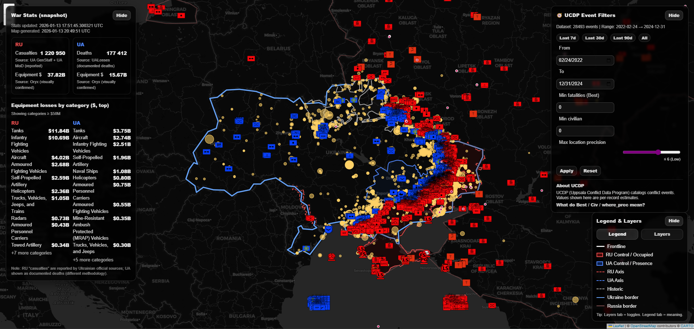
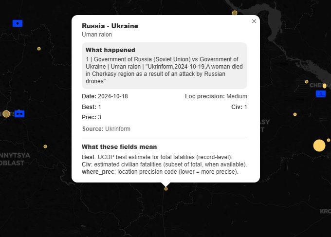

# Ukraine–Russia Conflict Map (Automated & Interactive)

## Preview

<p align="center">
  
  
</p>

## Overview

This repo builds an interactive analytical map by combining:

* Tactical layers extracted from a large KML dataset (frontline, control polygons, unit positions, axes)
* Event-level conflict data from UCDP (Uppsala Conflict Data Program)
* Snapshot statistics (personnel + equipment) from public datasets

The focus is **data engineering + visualization**: parsing, filtering, normalizing, and presenting multiple sources in a single explorable map.

## What’s included

* **`outputs/map.html`**: final interactive map (open locally in a browser)
* **Custom UI panels** inside the map:
  * War stats panel (top-left)
  * UCDP event filters (top-right)
  * Legend + Layers dock (bottom-right)

## Data Inputs & Sources

The pipeline automatically fetches data from these sources (configurable in scripts):

* **KML Tactical Dataset**
  * Source: [UA Control Map Backups](https://github.com/owlmaps/UAControlMapBackups)
  * URL: `https://raw.githubusercontent.com/owlmaps/UAControlMapBackups/master/latest.kmz`
  * Local files: `assets/doc.kml` & `assets/images/`

* **UCDP Events**
  * Source: UCDP GED API v25.1
  * Processed file: `data/processed/ucdp_live_data.json`

* **War Stats Snapshot**
  * Equipment Source: [Oryx](https://www.oryxspioenkop.com/) (Visually confirmed)
  * UA Personnel Source: [UALosses](https://ualosses.org/) (Documented deaths)
  * RU Personnel Source: [2022-Ukraine-Russia-War-Dataset](https://github.com/PetroIvaniuk/2022-Ukraine-Russia-War-Dataset)
  * RU Data URL: `https://raw.githubusercontent.com/PetroIvaniuk/2022-Ukraine-Russia-War-Dataset/main/data/russia_losses_personnel.json`
  * Processed file: `data/processed/war_stats.json`

* **Borders (optional)**
  * `assets/geo/ne_110m_admin_0_countries.*` (Natural Earth shapefile)

## Scripts

This project is designed as a small pipeline. Typical structure:

### 00–09: Data gather / prep

These scripts produce the processed JSON files used by the map builder.

* **`scripts/00_update_front_kmz.py`**
  Downloads the latest KMZ frontline map from the source URL and extracts assets.
* **`scripts/01_fetch_ucdp.py`**
  Downloads or refreshes UCDP event data (raw JSON).
* **`scripts/02_filter_ucdp.py`**
  Cleans, filters, and normalizes the raw UCDP data into a map-friendly format.
* **`scripts/03_fetch_equipment.py`**
  Scrapes and produces the snapshot stats panel dataset (personnel + equipment totals).

### 10: Build map (main step)

* **`scripts/10_build_map.py`**
  Parses the KML, filters folders, classifies features, builds layers, injects UI, and writes the final HTML.
  Output:
  * `outputs/map.html`

## Pipeline: Quick Start

### 1) Install dependencies

```bash
python -m venv .venv
# Windows:
.venv\Scripts\activate
# Linux/Mac:
source .venv/bin/activate

pip install -r requirements.txt
```

### 2) Run the pipeline

Since the scripts are set up to fetch data automatically:

```bash
# 1. Fetch Data
python scripts/00_update_front_kmz.py
python scripts/01_fetch_ucdp.py
python scripts/03_fetch_equipment.py

# 2. Process Data
python scripts/02_filter_ucdp.py

# 3. Build Map
python scripts/10_build_map.py
```

Open: `outputs/map.html`

## Running with Docker

Build the image:

```bash
docker compose build
```

Run the full pipeline (Fetch data → Process → Build map):

```bash
docker compose run --rm war-map /bin/bash -c "python scripts/00_update_front_kmz.py && python scripts/01_fetch_ucdp.py && python scripts/03_fetch_equipment.py && python scripts/02_filter_ucdp.py && python scripts/10_build_map.py"
```

Output location:

* `outputs/map.html`

## Interactive Features

### Layer system

* Frontline
* Control areas (polygons)
* Axes (UA / RU / historic)
* UA units (markers)
* RU units (markers)
* Borders (UA border shown by default; RU optional)
* UCDP events (toggleable)

### UCDP filter panel (top-right)

* Date range (From / To)
* Min fatalities (Best)
* Min civilian fatalities
* Max location precision (`where_prec`)
* Presets: last 7d / 30d / 90d / all

### Stats panel (top-left)

* Personnel snapshot
* Equipment cost estimate snapshot
* Top loss categories by estimated value

Panels are collapsible and store UI state in `localStorage`.

## Notes on UCDP fields

* **Best**: UCDP “best estimate” for total fatalities for that event record
* **Civ**: estimated civilian fatalities (subset of total when available)
* **where_prec**: location precision code (lower = more precise; higher = more coarse)

## Output

Main artifact:

* `outputs/map.html`

This file is self-contained and can be shared/opened without a backend server.

## Project Goals

* Parse a large hierarchical KML efficiently
* Filter “archive/old” layers automatically
* Normalize multiple datasets into a coherent spatial UI
* Provide fast interactive exploration (layers + event filters)

## License / Disclaimer

This repository is intended for **data processing and visualization**.
All values come from external datasets and may use different methodologies.
Do not treat the map as definitive attribution or ground truth.